# Platform Overview

This platform integrates multi-vendor 4G smartwatches while exposing a stable external contract for client systems.

Integration references:

- `docs/REST-CONTRACT.md`
- `docs/MQTT-CONTRACT.md`
- `docs/CLIENT-ONBOARDING.md`
- `docs/E2E-TESTING.md`

The architecture separates:

- Device-side protocols (internal only):
    - Wonlex framed JSON over socket transport (`FCAF + length + JSON`)
    - Vivistar IW/AP/BP text protocol over TCP
- Client-side integration (external):
    - REST API for control and command entry
    - MQTT for real-time event delivery

## Supported external integration surfaces

- REST audience: client backends and platform admins
- MQTT audience: client backends only (not direct mobile/web broker access)
- Device-facing WS/TCP channels: internal platform channels only

## Core Architecture

```text
                    Southbound (internal)                          Northbound (external)

+----------------------+     +-------------------------+       +-----------------------------+
| Smartwatches         | --> | Protocol Adapters       | ----> | Internal Event Bus          |
| - Wonlex             |     | - Wonlex Adapter        |       | (Redis today, MQTT-ready)   |
| - Vivistar           |     | - Vivistar Adapter      |       +--------------+--------------+
+----------------------+     +------------+------------+                      |
                                         |                                    |
                                         v                                    v
                              +-------------------------+        +-----------------------------+
                              | Core Platform Services  |        | External Integrators        |
                              | - Auth/Whitelist        |        | - Client Backends           |
                              | - Ownership checks      |        |   - REST (control plane)    |
                              | - Command state machine |        |   - MQTT (data plane)       |
                              +------------+------------+        +-----------------------------+
                                           |
                                           v
                                 +----------------------+
                                 | MySQL (required)     |
                                 | - clients/devices    |
                                 | - events             |
                                 | - command lifecycle  |
                                 +----------------------+
```

### Adapter boundary

Vendor protocol parsing/encoding is isolated in adapters. The rest of the platform consumes and emits canonical JSON envelopes.

## Visual End-to-End Flows

### What "Internal Bus" means

Internal bus = the platform's internal asynchronous messaging layer used between services.

- Today in this repo: mainly Redis Streams (`events`, `cmd:stream`)
- Target direction: Redis and/or MQTT-backed internal event routing
- Purpose: decouple ingestion, processing, command dispatch, and fanout without blocking request threads

## 1) Passive Telemetry Flow (watch -> client backend)


High-level steps:

1. Watch sends native telemetry packet to its adapter.
2. Adapter normalizes payload to canonical JSON.
3. Platform validates policy/security and persists event.
4. Platform publishes event to internal bus and MQTT tenant topic.
5. Client backend receives real-time data from MQTT.

## 2) Active Command Flow (client backend -> watch -> result)

```mermaid
flowchart LR
    C[Client Backend sends REST command request] --> R[REST API authn/authz and ownership checks]
    R --> P[Validate model capability and command policy]
    P --> D1[(Create command in MySQL: requested/accepted)]
    D1 --> B[Publish dispatch task to Internal Bus]
    B --> A[Protocol Adapter translates to native command]
    A --> W[Send command to watch]
    W --> A2[Watch returns native ack/reply or telemetry]
    A2 --> N[Adapter normalizes result/event]
    N --> D2[(Update MySQL lifecycle: dispatched/ack/timeout/failed)]
    D2 --> M[Publish command result/status to MQTT]
    M --> C2[Client Backend receives outcome in real time]
```



High-level steps:

1. Client backend submits command through REST (external command entrypoint).
2. Platform validates tenant ownership and model capability.
3. Command lifecycle starts in DB and dispatch task is queued.
4. Adapter translates and sends native command to watch.
5. Watch response is normalized; lifecycle is updated and pushed to MQTT.

## Integration Model

## REST (Control Plane)

Use REST for:

- client and device registration/management
- command submission (external command entrypoint)
- ownership-scoped reads (state/history)
- governance operations (model policy, whitelist operations)

## MQTT (Data Plane)

Use MQTT for:

- low-latency telemetry fanout
- command result/ack fanout
- status and operational event streams

External clients do **not** publish commands directly to device topics. Commands enter via REST, then the platform dispatches internally and tracks lifecycle.

## Why REST + MQTT together

- REST gives strong control, authorization, idempotency, and auditability.
- MQTT gives scalable real-time delivery.
- Combined model keeps command governance centralized while keeping data delivery fast.

## Multi-Tenant Access Rules

The platform operates with strict tenant isolation.

- Every device belongs to exactly one client context (`client_id`).
- Every read/write path is scoped by `client_id`.
- Cross-client access is denied unless performed by explicit platform-admin flows.

## Model governance policy

- Global model allowlist policy is enforced platform-wide.
- Only approved supplier/model combinations are accepted.
- Whitelist binds `IMEI -> supplier/model -> client`.

## MQTT Access for Clients

Client MQTT access is provisioned through per-client service accounts.

### Authentication and ownership

- One service account per client integration backend.
- Credentials are managed by the platform.
- Topic ACLs are scoped by client tenant namespace.

### Runtime integration pattern

- Client backend connects to broker.
- Mobile/web apps consume data from that backend (not directly from MQTT broker).
- This reduces credential leakage and simplifies rotation/auditing.

### Topic design principles

- tenant-scoped prefixes
- explicit direction (`telemetry`, `command_result`, `status`, `errors`)
- stable schema versions in payloads
- no vendor-private secrets in external payloads

## Command Lifecycle

Command lifecycle is tracked durably:

`requested -> accepted -> dispatched -> ack | timeout | failed`

Required behaviors:

- correlation IDs on all command and result events
- idempotency for command submission
- durable status transitions for audit and retries
- vendor-specific protocol correlation handled in adapters

## API + MQTT Contract Principles

All external contracts use canonical JSON.

- Vendor protocol differences are abstracted behind normalized fields.
- Native/vendor metadata can be exposed as optional metadata blocks.
- Contract stability is prioritized over vendor-specific payload shape.

## Public interface rules

- REST: external control plane for client backends and admins
- MQTT: external data plane for client backends
- WS/TCP watch links: internal-only
- Ownership checks: mandatory and tenant-scoped
- Model acceptance: global policy-enforced

## Local Development (Current State)

Current repository runtime is still in transition toward this target architecture.

### Implemented today

- WS ingestion server for current watch protocol path
- native Vivistar TCP ingress listener (`tcp://...`, IW text protocol)
- protocol adapter layer with Wonlex and Vivistar adapters
- REST API server
- Redis streams for internal buffering/routing
- MySQL persistence for clients/devices/events
- worker process for stream-to-DB ingestion

### Not fully implemented yet

- full external MQTT onboarding layer (credentials + ACL automation)
- command lifecycle persistence/state machine end-to-end

### Local stack

`docker-compose.yml` currently provides:

- `mysql`
- `redis`
- `ws`
- `api`
- `worker`
- `nginx`

Default ingress ports:

- Wonlex/WebSocket: `8080`
- Vivistar/native TCP: `9000`

### Protocol-aware simulator (single entrypoint)

`simulator/simulate.php` now auto-selects the device protocol from `config/capabilities.json`.

- Wonlex models: framed JSON login/data flow
- Vivistar models: `IW...#` AP/BP flow

Examples:

```bash
# Wonlex
php simulator/simulate.php --server ws://127.0.0.1:8080 \
  --model WONLEX-PRO --imei 865028000000306 \
  --command upHeartRate --data '{"heartRate":72}'

# Vivistar
php simulator/simulate.php --server ws://127.0.0.1:8080 \
  --model VIVISTAR-CARE --imei 865028000000308 \
  --command AP49 --data '{"heartRate":68}'

# Vivistar (native TCP transport)
php simulator/simulate.php --server tcp://127.0.0.1:9000 \
  --model VIVISTAR-CARE --imei 865028000000308 \
  --command AP49 --data '{"heartRate":68}'
```

Listen mode (for server -> device command tests):

```bash
php simulator/simulate.php --server ws://127.0.0.1:8080 \
  --model VIVISTAR-CARE --imei 865028000000308 --listen

php simulator/simulate.php --server tcp://127.0.0.1:9000 \
  --model VIVISTAR-CARE --imei 865028000000308 --listen
```

### Full test runbook

For the exact 3-terminal flow (logs + simulator + API commands) with expected outputs and troubleshooting, use:

- `docs/E2E-TESTING.md`

## Roadmap

1. Adapter extraction

- separate Wonlex and Vivistar protocol modules
- keep canonical envelope contract stable

2. AuthZ + ACL

- enforce tenant-scoped REST authz
- provision per-client MQTT service accounts and topic ACLs

3. Command state machine

- persist command lifecycle and correlation
- add timeout/retry/error terminal states

4. Production MQTT onboarding kit

- integration guide for client backends
- topic catalog and schema references
- language SDK snippets and operational runbook

## Assumptions locked for this architecture

- README scope: architecture-first
- README language: English
- model policy: global allowlist
- ownership policy: strict client isolation
- persistence policy: MySQL required
- external command entrypoint: REST only
- MQTT exposure: yes, but backend-to-broker only using per-client service accounts
